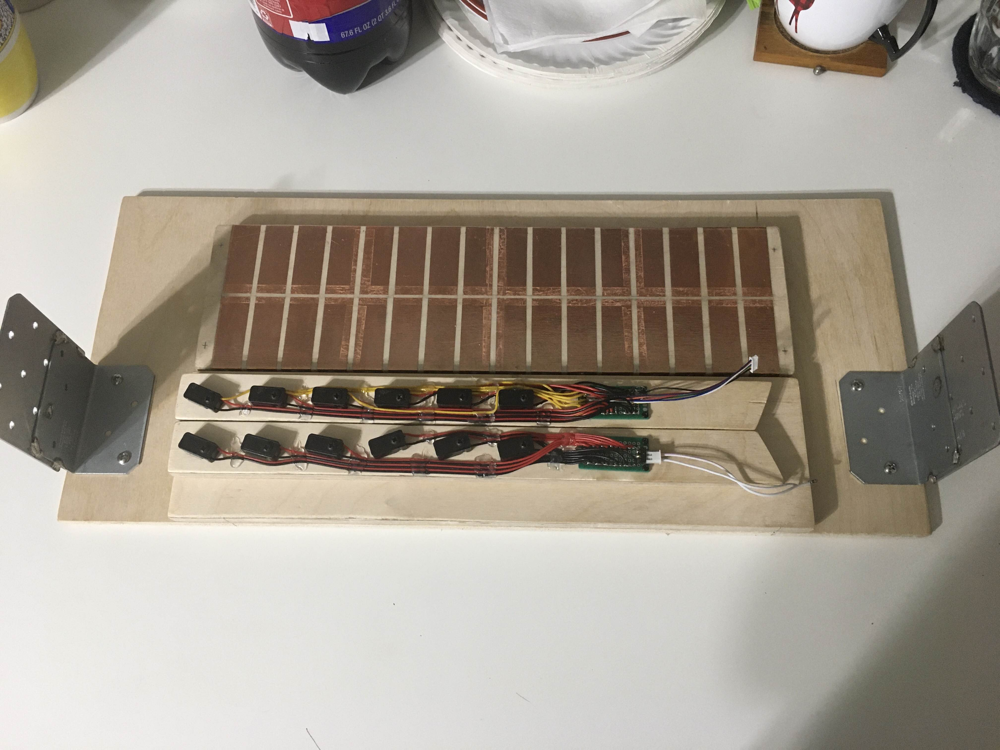
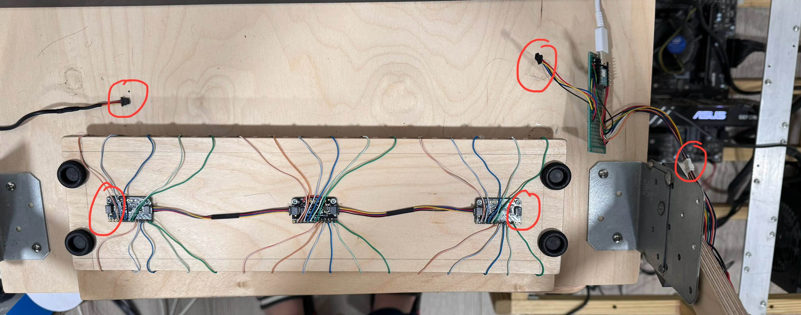

# Woodithm 
Controller Version: V1.116.1.0

Bare minimum build to play (totally not) Chunithm

> [!Note]
> Slider was sized and build for playing on a 24" monitor, NOT the 32" full-sized slider but can be scaled up with slight modifications.

> [!Warning]
> Very stable config, please do not touch or it may explode.

## Build:

### Design:

Size of slider and wood is dependent on size of monitor that is being used. This project is **designed specifically** for playing on a 24" monitor.

### Wiring:

More detailed wiring information can be found in IRsensor.h, SetupConfig.h, and TouchSlider.h

## Parts List:
- Main Board
    - Seeeduino Xiao (SAMD21) (Find it on amazon or wherever you prefer) 
    OR 
    - Adafruit QT Py - SAMD21 Dev Board with STEMMA QT https://www.adafruit.com/product/4600
- 3x Adafruit 12-Key Capacitive Touch Sensor Breakout - MPR121 - STEMMA QT https://www.adafruit.com/product/1982
- 3-4x STEMMA QT / Qwiic JST SH 4-pin Cable (100mm) https://www.adafruit.com/product/4210 (3x if you are using the Seeeduino Xiao / 4x if you are using the Adafruit QT Py)
    - Add a couple of QT with male headers to solder to PCB if using the XIAO https://www.adafruit.com/product/4209
- 8-pin Cable https://www.adafruit.com/product/4976 (For easily detaching IR reciever tower)
- 6x IR Break Beam Sensor with Premium Wire Header Ends - 5mm LEDs https://www.adafruit.com/product/2168
- 1x Mini360 (Or DN-Mini-360) or LM2597 DC Buck Converter Module - Look on eBay or Aliexpress (For IR emmitter tower)
- Copper Tape (Depends on size of slider, 1 inch wide is about good for a full-sized one)
- Some Wood

## Required Libraries
- Adafruit MPR121 1.1.3 **(This specific version)**
- Adafruit Circuit Playground 1.12.0
- Adafruit BusIO 1.16.0
- HID Project 2.8.4

> [!Caution]
> Versions of the libraries above are **strongly recommended** since the code is specifically configured using these versions. Using updated versions may cause to code to fail to compile.

## Optional Board Libraries
- Seeeduino SAMD Boards 1.8.4 **(Later versions might not compile properly)**

      https://files.seeedstudio.com/arduino/package_seeeduino_boards_index.json

Not necessary if not using the Seeeduino XIAO

> [!Note]
> This was a Private Repo until **Yesterday (Feb 13th 2025)** so there was NO DOCUMENTATION whatsoever so I probably missed a lot since this is code I haven't touched in months.
> I tried to provide as much information as I can remember but if there's something I missed, best to try to message me in issues tab (or discord if you can find me) and I'll try to respond as soon as I can.
